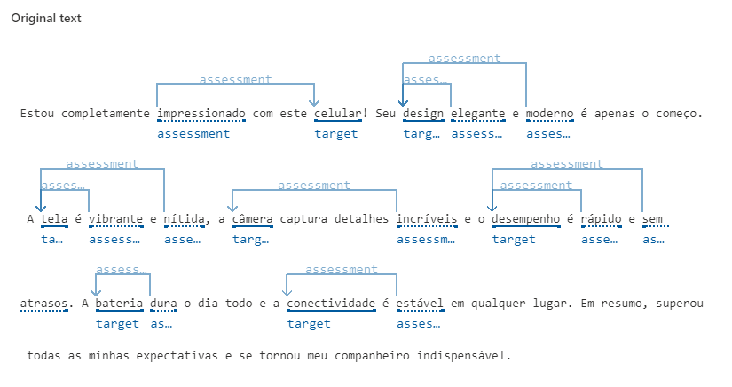
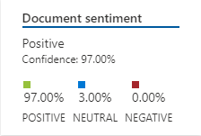
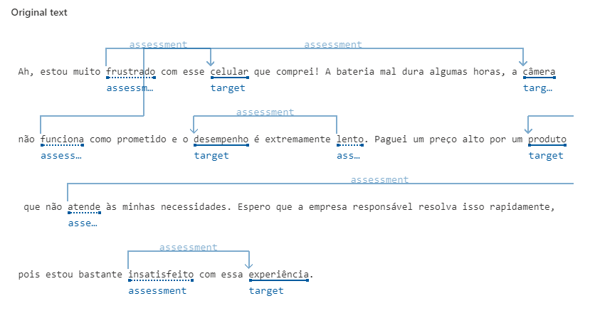
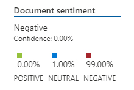

  
  <h1>Relatorio-AzureIA-analise-sentimentos</h1>
  

  
  

  
  
  

 

## Análise de sentimentos e opniões:

### Opção do recurso no Azure IA:

### Análise positiva:

#### Texto a ser analisado (input):

"Estou completamente impressionado com este celular! Seu design elegante e moderno é apenas o começo. A tela é vibrante e nítida, a câmera captura detalhes incríveis e o desempenho é rápido e sem atrasos. A bateria dura o dia todo e a conectividade é estável em qualquer lugar. Em resumo, superou todas as minhas expectativas e se tornou meu companheiro indispensável".

#### Texto analisado (output):

#### Estatísticas (output):

### Análise negativa:

#### Texto a ser analisado (input):

"Ah, estou muito frustrado com esse celular que comprei! A bateria mal dura algumas horas, a câmera não funciona como prometido e o desempenho é extremamente lento. Paguei um preço alto por um produto que não atende às minhas necessidades. Espero que a empresa responsável resolva isso rapidamente, pois estou bastante insatisfeito com essa experiência".

#### Texto analisado (output):

#### Estatísticas (output):

## Conclusão:

Esta ferramenta pode ser extremamente conveniente para empresas que precisam analisar grandes quantidades de feedback de clientes. Com automação, o processo se torna fácil e eficiente, pois todos os feedbacks são analisados com base na detecção de sentimentos por inteligência artificial. Essa abordagem automatizada simplifica o trabalho, permitindo que as empresas obtenham insights valiosos de forma rápida e precisa.
